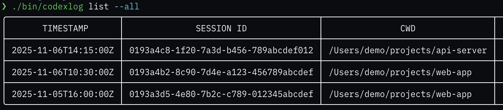
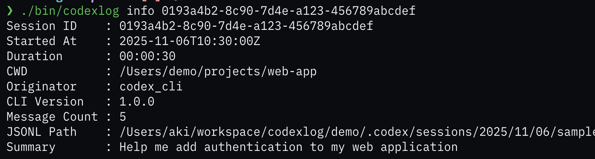
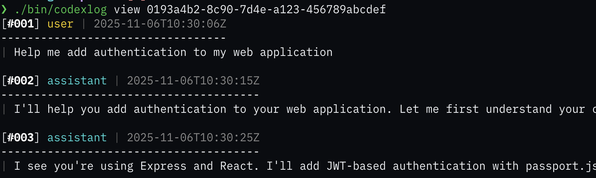
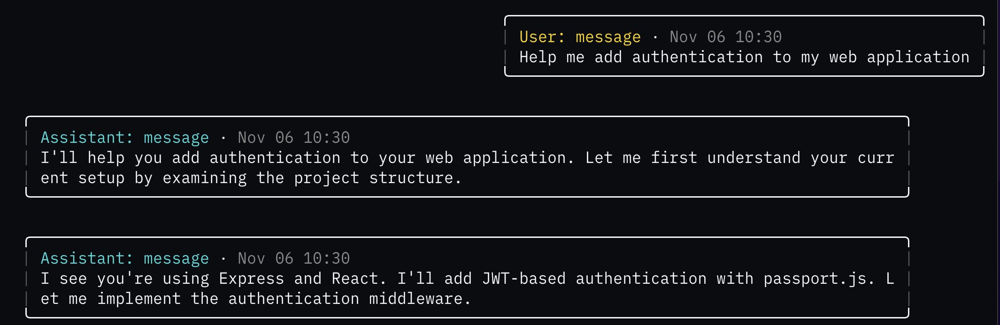

# agentlog

[](https://github.com/choplin/agentlog/actions/workflows/ci.yml)
[](https://opensource.org/licenses/MIT)
[](https://golang.org)

Browse, search, and analyze AI agent conversation logs.

## Why agentlog?

Ever wished you could easily search through your past AI agent conversations? Or review what decisions were made in previous sessions? agentlog gives you powerful tools to explore your conversation history:

- 📊 **Instant overview** of all your sessions with duration and message counts
- 🔍 **Quick search** through conversation summaries
- 💬 **Beautiful chat view** that recreates the conversation flow
- 🎯 **Filter and analyze** specific parts of sessions

## Quick Start

```bash
# Install via Homebrew
brew install choplin/tap/agentlog

# List your recent sessions
agentlog list

# View a session in chat format
agentlog view <session-id> --format chat
```

## Features

### 📋 Browse All Sessions



See all your Codex sessions at a glance. Sort by date, filter by project directory, and quickly identify sessions by their opening message.

### 📝 Session Details



Get the full picture: when a session started, how long it lasted, how many messages were exchanged, and where to find the raw log file.

### 📖 Read Transcripts



Review conversations in a clean, numbered format. Perfect for extracting specific information or sharing with teammates.

### 💬 Chat View



Relive your conversations with a familiar chat interface. User messages on the right, assistant responses on the left, complete with timestamps and color coding.

## Installation

### Homebrew

```bash
brew install choplin/tap/agentlog
```

### From Source

```bash
go install github.com/choplin/agentlog/cmd/agentlog@latest
```

## Configuration

By default, agentlog looks for session logs in `~/.codex/sessions`. You can override this with the `AGENTLOG_SESSIONS_DIR` environment variable:

```bash
export AGENTLOG_SESSIONS_DIR=/path/to/your/sessions
```

Or use the `--sessions-dir` flag for individual commands.

## Usage

### List Sessions

```bash
# List recent sessions
agentlog list

# List all sessions
agentlog list --all

# Different output formats
agentlog list --format jsonl
agentlog list --format plain
```

### View Session Details

```bash
# Show session metadata
agentlog info <session-id>

# JSON output
agentlog info <session-id> --format json
```

### View Transcripts

```bash
# Text format with numbered messages
agentlog view <session-id>

# Chat format with bubbles
agentlog view <session-id> --format chat

# Show all entry types (including reasoning, function calls)
agentlog view <session-id> --format chat --all

# Limit to recent messages
agentlog view <session-id> --format chat --max 20
```

## Advanced Features

- **Multiple output formats**: table, plain, json, jsonl for different use cases
- **Filtering**: Filter by entry type, role, or response type
- **Session duration tracking**: See how long each session lasted
- **Full log support**: Handles all Codex entry types including encrypted reasoning
- **Color coding**: Role-based colors and bubble alignment in chat view

## License

MIT
